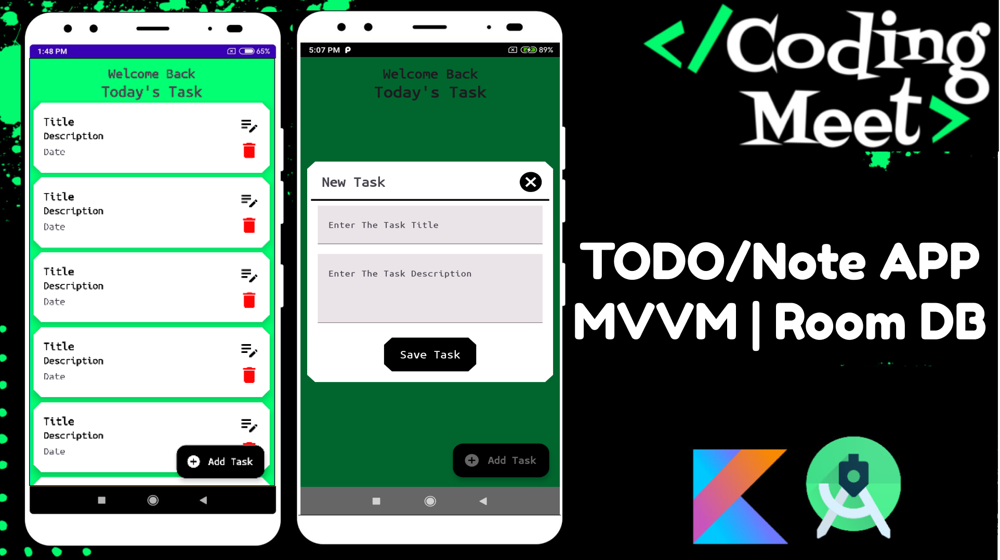
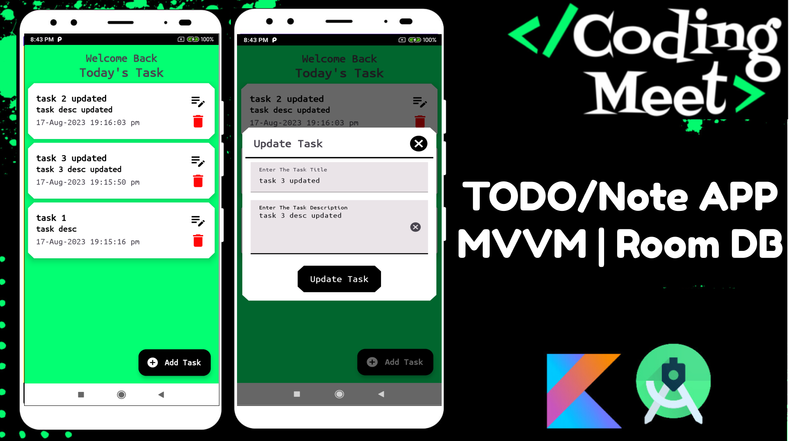
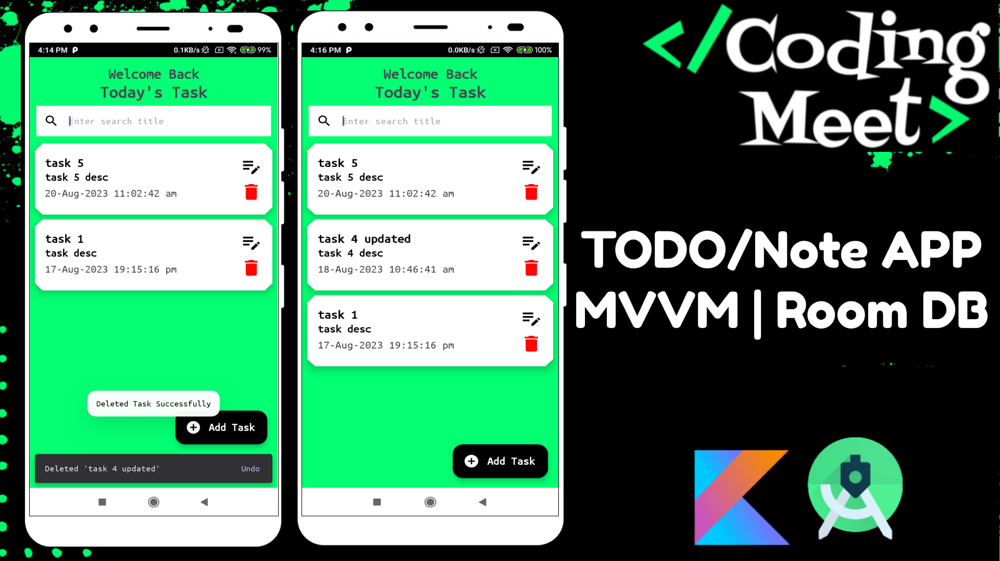
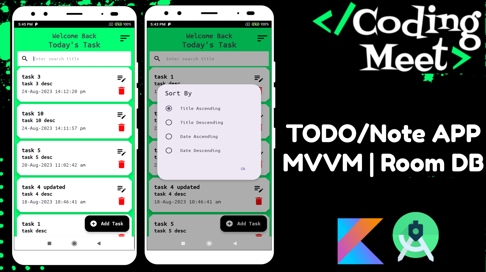
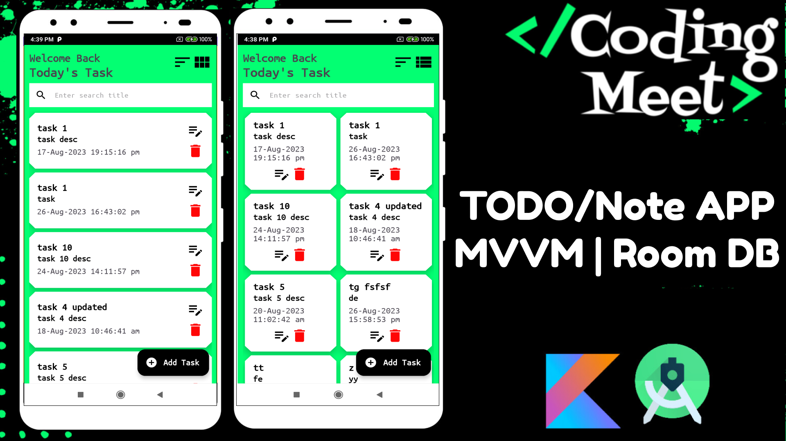

## TODO/Note App Tutorial MVVM | Room DB | Android Studio Kotlin

# [YouTube Video Link](https://youtube.com/playlist?list=PLlSuJy9SfzvFqbcWKhs-a3NtYQicyCFo8&si=qzFBbjdimUdyY2t6)

Welcome to the Comprehensive TODO/Note App Tutorial Playlist! 📱📝

In this tutorial playlist, you'll learn how to create a robust TODO/Note App from scratch using the power of MVVM architecture and Room Database with Kotlin in Android Studio. Whether you're a beginner or seeking to enhance your skills, this playlist covers it all.

## 📌Part 1: Designing Insert, Update, and View Dialogs
Discover the fundamentals as we design intuitive dialogs for adding, updating, and viewing notes/tasks.

## 📌Part 2: MVVM, Room DB, Design Loading Dialog and Validation
Delve into MVVM architecture, Room Database integration, loading dialogs, and data validation.

## 📌Part 3: Insert Task Implementation
Learn how to seamlessly insert tasks into the app using MVVM and Room Database.

## 📌Part 4: View Task List Implementation
Explore displaying tasks using RecyclerView, optimizing the user experience.

## 📌Part 5: Delete Task Implementation
Master the art of deleting tasks effortlessly with MVVM and Room Database.

## 📌Part 6: Update Task Implementation
Dive into updating tasks seamlessly using MVVM and Room Database.

## 📌Part 7: View Binding in RecyclerView
Simplify UI development with View Binding in RecyclerView for smoother interactions.

## 📌Part 8: ListAdapter, DiffUtil in RecyclerView
Optimize your app's UI and performance with ListAdapter and DiffUtil.

## 📌Part 9: Refactoring TaskRepository for Improved Performance
Enhance app performance through efficient data handling and coroutine management.

## 📌Part 10: Implementing Task Search
Master the power of search functionality in your app using MVVM and Room Database.

## 📌Part 11: Restoring Deleted Tasks
Implement the ability to restore accidentally deleted tasks for a seamless user experience.

## 📌Part 12: Enhancing UI with AppBar and RecyclerView
Elevate your app's UI with dynamic AppBar integration and smooth scrolling.

## 📌Part 13: MVVM, Room DB, Sort By Task
Learn to sort tasks effectively using MVVM architecture and Room Database.

## 📌Part 14: Nested ScrollView RecyclerView
Enhance your app's interface with Nested ScrollView and RecyclerView for efficient data presentation.

## 📌Part 15: Staggered Grid & Linear Layout Managers
Discover the art of engaging layouts using Staggered Grid and Linear Layout Managers.
